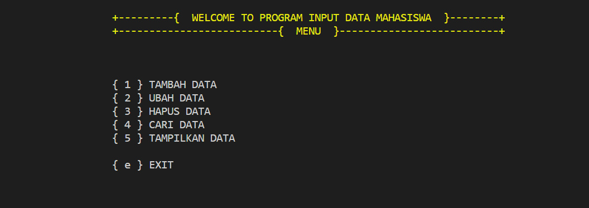
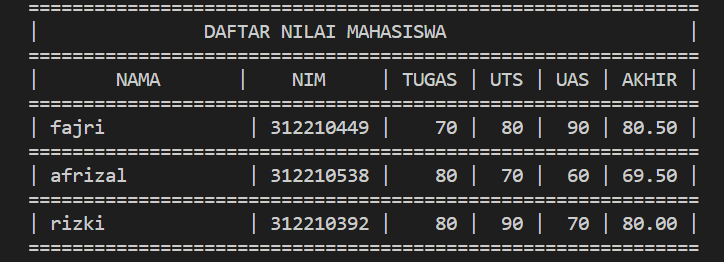
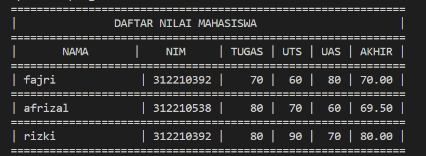

# UAS1

## **DESKRIPSI**

### **main.py**

- File ini berfungsi untuk mengimport modul - modul yang di buat.

  - Contoh pengimportan modul :

```sh
# mengimport class view dari modul view_nilai di dalam folder view
from view.view_nilai import view
# mengimport class daftar dari modul daftar_nilai di dalam folder daftar
from model.daftar_nilai import daftar
```

### **model/\_data.py**

- Modul ini berfungsi sebagai penampung data dari modul - modul yang di buat.

### **model/ \__init_.py & view/ \__init_.py**

- Modul ini di isi dengan method Init dan berfungsi sebagai method yang pertama kali di jalankan atau di proses sebelum method-method yang lainnya dan method
  \__init_() berguna untuk melakukan inisialisasi pembuatan object dari class.
  - contoh pembuatan method \__init_()

```sh
def __init__(self, nama, nim):
    self._nama = nama
    self._alamat = nim
```

### **view/input_nilai.py**

- Modul ini di isi class input*data dan di isi dengan method inputan - inputan untuk modul - modul lainnya dan di inisialisasi dari method \_\_init*.
  - contoh pembuatan input:

```sh
self._nama = input('Masukan Nama : ')
self._nim = input('Masukan Nim : ')
```

### **view/input_nilai.py**

- Modul ini di berisi method cetak data mengimport dari modul **model/\_data.py**
  - contoh import dan cetak data:

```sh
# mengimport class data dari modul _data di dalam folder model
from model._data import data
# mencetak hasil inputan yang di tampung di class data
print("| {0:15}   | {1:9} |".format(self.nama, self.alamat)
```

### **model/daftar_nilai.py**

- Modul ini di isi dengan class yang berisi method - method :
  1. **tambah_data()** yang mengimport modul inputan dari input_nilai dan di masukan ke modul data.
  2. **ubah_data()** yang mengimport modul inputan dari input_nilai dan menggunakan pengkondisian jika inputan di dalam modul data lalu memasukan inputan baru dari modul input_nilai ke dalam modul data.
  3. **hapus_data()** yang mengimport modul inputan dari input_nilai dan menggunakan pengkondisian jika inputan di dalam modul data lalu **menghapus** data di dalam modul data yang sesuai dengan modul inputan dari input_nilai.
  4. **cari_data()** yang mengimport modul inputan dari input_nilai dan mencetak data dari modul view_nilai yang sesuai dengan inputan dari modul input_nilai
     contoh program:

```sh
def tambah_data(self):
    # modul input_nilai
    # memasukan input_nilai ke modul data
def ubah_data(self):
    # modul input_nilai
    # pengkondisian jika modul input_nilai di dalam modul data
    # memasukan modul input_nilai baru ke dalam modul data
def hapus_data(self):
    # modul input_nilai
    # pengkondisian jika modul input_nilai di dalam modul data
    # hapus data yang sesuai modul input_nilai
def cari_data(self):
    # modul input_nilai
    # pengkondisian jika modul input_nilai di dalam modul data
    # modul view
```

## **screenshoot program**


<br>

### **TAMBAH DATA**



### **UBAH DATA**



### **HAPUS DATA**


### **CARI DATA**

